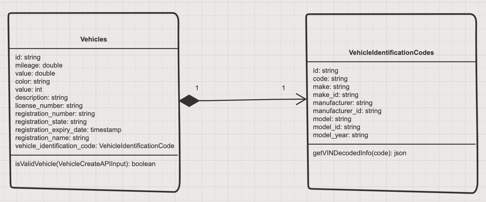

# carSHAiR Backend Assessment

## Assumptions

- Cars are not owned by users, so no authorization is needed to read, create, update or delete a car resoruce.
- A VIN is unique, which cannot be shared by multiple vehicles.
- A license plate is unique, which cannot be shared by multiple vehicles.
- The format of license plate must be consisted of 6 characters (length must be 6), no matter which issuing country it belongs to.
- Registration number should be same as license plate number.
- An invalidate VIN means the VIN cannot be decoded by Decode VIN api (Third-Party api)(<https://vpic.nhtsa.dot.gov/api/>)
- Registration expiration only accept date format in MM/DD/YY
- Car value cannot be a negative number.
- Current mileage cannot be a negative number.
- Name of registration cannot be empty and no more than 128 characters.
- Vehicle description can be null or no more than 10240 characters.
- Vehicle color only accept HTML color codes format (two digit hexadecimal format).
- Vehicle Identification Code object cannot exist without Vehicle object.
- Hard delete is going to adapt in this task.

## Goal and requirements

- System should be able to create, read, update, delete for a car resource.
- System should be able to decode the VIN.
- System should be able to validate the VIN format by calling (Third-Party api) and check whether the VIN has already existed in the database.
- System should be able to store the decoded VIN information into database.

## UML Diagram


## API Document
[Vehicle Api Doc](./docs/api_vehicle.md)

## Getting Started

1. Bring up the MySQL database
```
  docker compose up
```

2. Bring up express server in development mode
```
  yarn install
  yarn run dev
```

3. Create vehicle
```
  sh ./script/create_vehicle.sh
```

4. Get vehicle (need to modify vehicle_id inside script)

```
  sh ./script/get_vehicle.sh
```

5. Update vehicle (need to modify vehicle_id inside script)

```
  sh ./script/update_vehicle.sh
```

6. Delete vehicle (need to modify vehicle_id inside script)

```
  sh ./script/delete_vehicle.sh
```

### Feedback
Working on this assignment, l used tools which l am not familar with (typeorm and routing-controllers). The assessment took around 14 hours to complete. Breaking down the task into small pieces, l took roughly 2 hours making assumptions and clarifications. Besides, another 2 hours was allocated to design API and database schemas. Also, l spent around 4 hours to study and test for those libraries, with extra 5 - 6 hours working on the code, integration and api documentation. The general experience is good and a XD file help me visialize the user journey. A tiny suggestion on top of this is adding user input constraints next to the XD design, so that both frontend and backend engineers can know the details for input. Due to time constraint, l did not implement test cases, this always treat as a good practise in any kind of development. For my personal perference, l would love to do take home assessment rather than leetcode, with less pressure on it.
